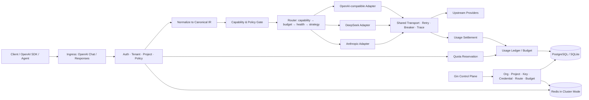
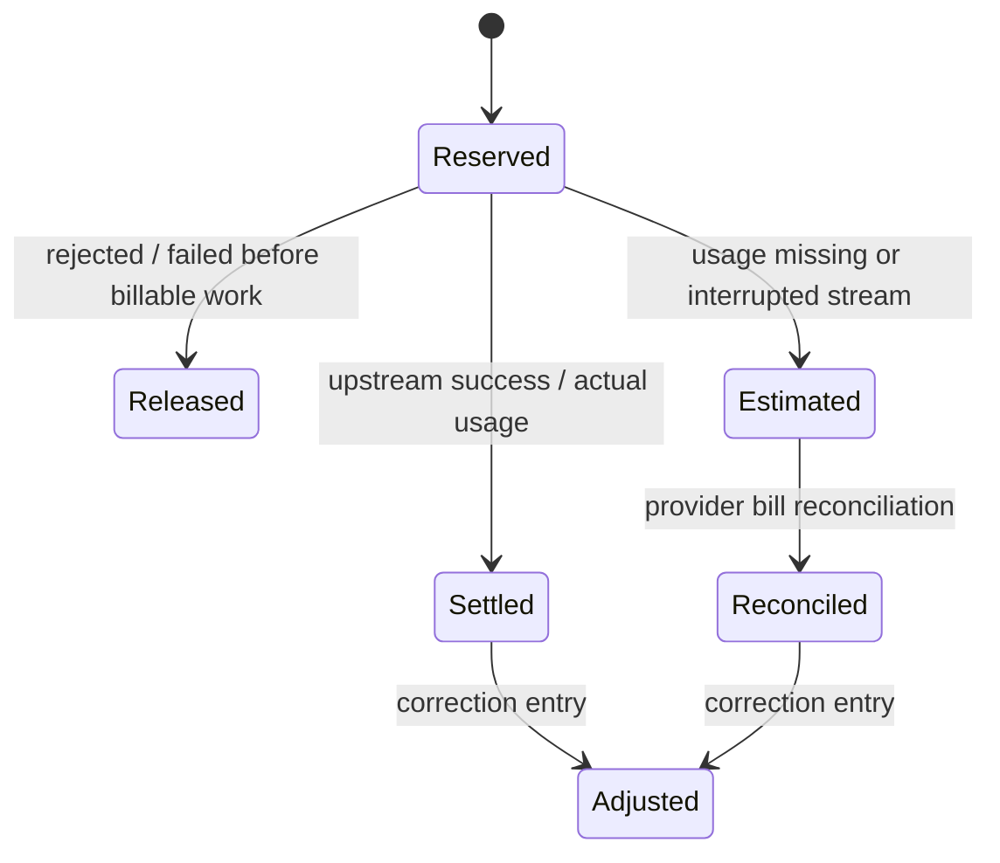

# AI Gateway v2.0 重构与产品化升级设计文档

> 文档状态：**Approved Baseline（后续开发唯一基线）**
> 文档版本：1.1（Local HEAD Re-audit）
> 创建日期：2026-08-05
> 适用仓库：[aqww5941-wq/ai-gateway](https://github.com/aqww5941-wq/ai-gateway)
> 当前实施基线：`D:\ai-gateway`，`master@3b561f183bac7647f5cb94ee03dd4932713f395e`
> 目标版本：v2.0 → v2.1 → v2.2
> 核心原则：修改前分析根因，禁止止血式修补；所有实现必须关联需求编号、设计决策和验收标准。

---

## 0. 文档用途与治理规则

本文件不是愿望清单，而是 AI Gateway 后续重构、开发、测试和发布的执行合同。

### 0.1 使用规则

1. 每个 Issue、Commit 或 PR 必须关联本文中的需求编号，例如 `PRO-001`、`TEN-003`。
2. 涉及公共协议、数据模型、持久化、安全边界或兼容性的修改，必须先新增或更新 ADR，再编码。
3. 若实现与本文冲突，应先修改本文并说明原因，不允许代码先行后补文档。
4. 每个里程碑只有满足 Exit Gate 后才能进入下一阶段。
5. 未经过自动化测试、真实协议回放和文档同步的功能，不计为完成。
6. “生产级”“高可用”“企业级”等表述只有在相应验收门槛通过后才能出现在 README 和简历中。

### 0.2 变更分级

| 级别 | 示例 | 要求 |
|---|---|---|
| L1：局部实现 | 内部函数重构、日志字段调整 | 单元测试、Code Review |
| L2：模块行为 | 新增路由策略、修改配额规则 | 设计说明、集成测试、兼容性检查 |
| L3：公共契约 | API、Canonical IR、数据库Schema、Adapter接口 | ADR、迁移方案、合约测试、版本说明 |
| L4：安全/账务 | 密钥、计量、余额、账本、租户隔离 | 威胁建模、并发测试、故障测试、审计证明 |

---

## 1. 执行摘要

AI Gateway v2.0 将从“单机、多厂商基础转发网关”升级为：

> **面向个人开发者和企业团队的多租户 LLM 接入、协议适配、路由治理、密钥管理、用量计量与成本控制平台。**

产品需要同时解决三个核心问题：

1. **个人开发者无需因更换模型厂商而修改 Base URL、SDK 初始化和业务代码。**
2. **不同厂商的异构能力不会被压缩成最低公共子集，Tools、Reasoning、Structured Output、Multimodal 和 Streaming 能被正确表达、转换和验证。**
3. **企业能够安全管理厂商凭据、成员、项目、客户端 API Key、Token 配额、预算、用量、账单和审计。**

v2 的关键架构变化：

- 数据面继续使用 `net/http`，保持对 SSE、连接生命周期和高并发链路的直接控制。
- 控制面采用 Gin，承载组织、项目、密钥、策略、预算、用量和管理 API。
- API DTO 与内部语义模型分离，引入 Canonical IR。
- 路由从“模型名 + 权重”升级为“能力约束 + 租户策略 + 预算 + 健康度 + 调度策略”。
- Provider 从简单 Base URL 代理升级为可测试的协议 Adapter。
- SQLite 保留为单机模式；PostgreSQL、Redis 和可选消息总线支撑集群模式。
- Token 使用从请求后简单累加升级为预授权、结算、回滚、不可变账本和对账。

### 1.1 本地最新版复审结论

2026-08-05 对 `D:\ai-gateway` 的本地最新版进行了重新审计。此前从 GitHub 读取的版本不再作为实施依据，后续所有设计、Issue 和验收均以本节记录的 Local HEAD 为起点。

本地 HEAD 相比此前快照新增或强化了 React 管理后台、管理 API、SQLite API Key、Admin/User 角色、模型白名单、审计日志、日/月配额字段和本地 Shell 启停脚本。因此，v2 不应重复开发一套平行的“企业功能”，而应采用以下策略：

1. 保留已经验证过的缓存、熔断、重试、限流、路由和管理后台资产；
2. 将现有 Key、Quota 和 Audit 视为 v1 Legacy Schema，通过迁移演进到 Organization、Project、Credential、Budget 和 Ledger；
3. 先修复运行时快照、配置、迁移、并发额度和构建可复现性，再引入 Canonical IR；
4. 现有 `/admin/api/v1` 在 Gin 控制面上线前保持兼容，不在 `net/http` 与 Gin 之间重复堆业务；
5. 不对旧 `ChatRequest` 继续增加厂商字段，所有新协议能力从 M1 的 Canonical IR 进入。

### 1.2 已验证的工程基线

| 项目 | 结果 | 结论 |
|---|---|---|
| Git 工作树 | 初始为 clean，`master` 与 `origin/master` 一致 | 可作为基线，但尚无正式 release tag |
| Go | `go1.26.5 windows/amd64` | 满足 `go.mod` 的 `go 1.26.4` 最低要求 |
| 前端 | Node `22.14.0`、npm `10.9.2`，生产构建通过 | `web/dist` 被跟踪且构建会产生工作树变化，产物策略需治理 |
| Go Build | 通过 | Windows 本地可生成 `bin/gateway.exe` |
| Unit Test | 全部通过 | 通过不代表关键模块已覆盖 |
| Race Test | 开启 CGO 后全部通过 | 现有用例未覆盖热重载、Store 配额并发等关键竞争路径 |
| `go vet` | 通过 | 基础编译期检查正常 |
| `golangci-lint 2.12.2` | 未通过，37 项 | 33 项未处理错误、4 项 staticcheck 问题，应纳入 M0 |
| 总覆盖率 | 35.7% | Store、Provider、Config 等关键包为 0%，不满足重构保护要求 |

### 1.3 本地复审新增的 P0 问题

以下问题必须在协议重构前得到设计性处理，禁止用局部条件判断止血：

- **BASE-001：构建不可复现。** `web/dist` 与 `internal/static/dist` 双份提交，前端构建会污染工作树；Makefile 和 `start.sh`/`stop.sh` 只适用于类 Unix 环境，Windows 没有等价入口。
- **BASE-002：热重载不是完整原子快照。** Reload 只交换 Config、Router 和 Provider，Handler 热路径存在未统一通过快照读取的字段；Cache、Filter、Limiter、Transport、Store 等配置也没有明确的“可热重载/需重启”边界。
- **BASE-003：配置契约不完整。** YAML 中存在未进入结构体的超时字段，关键默认值散落在构造函数，缺少严格校验、未知字段拒绝和有效配置导出。
- **SEC-001：示例配置包含固定可用 Key。** `sk-test-123` 与 `sk-user-demo` 不应成为默认运行凭据；生产启动必须检测弱默认密钥并拒绝或显式标记开发模式。
- **KEY-000：Key 查询不可扩展。** 当前按请求扫描全部有效 Key Hash，缓存失效后复杂度为 O(n)；停用 Key 最长可在缓存中继续生效一分钟。
- **TOK-000：配额检查与记账分离。** `CheckQuota` 与 `RecordUsage` 非原子，月配额未执行，流式/非流式超额窗口都可能穿透，数据库错误当前 Fail Open。
- **TOK-001：当前记录不是账本。** 缺少 request/event 幂等键、预占、结算、释放、冲正、价格快照和不可变事件，不能支撑企业对账。
- **TEST-001：关键包无保护。** `internal/store` 与 Provider 主路径覆盖率为 0%，管理 Key、Migration、Quota、真实 Adapter 编解码不能安全重构。

这些问题不在本轮审计中直接修补；它们先进入需求、ADR、测试和 Exit Gate，再按里程碑实施。

---

## 2. 当前系统审计与根因分析

### 2.1 已有资产

当前项目已经具备有价值的基础：

- OpenAI 风格 `/v1/chat/completions` 入口；
- 非流式与 SSE 流式代理；
- 多目标路由、失败回退和延迟感知；
- 熔断、指数退避、Singleflight、并发队列；
- 内存/Redis 缓存；
- API Key、RBAC、日/月配额数据结构；
- SQLite 审计与用量记录；
- Prometheus、OpenTelemetry、结构化日志；
- React 管理后台；
- 现有单元测试和 Benchmark 基础。

本次升级应保护这些资产，通过分层迁移替代推倒重写。

### 2.2 根因一：内部协议模型过窄

当前 `ChatRequest` 仅能表达文本消息、温度、最大 Token 和流式开关，不能完整表达：

- 多模态内容块；
- Tool Definition、Tool Choice、Tool Call、Tool Result；
- Structured Output / JSON Schema；
- Reasoning / Thinking 参数及内容；
- 厂商特有缓存、服务等级、采样与安全参数；
- 更完整的 Usage、Stop Reason、Refusal、Citation 和错误信息。

因此所谓“多厂商适配”实际上主要依赖 OpenAI 兼容格式与 Base URL 切换，厂商差异会被丢弃。

### 2.3 根因二：Provider 抽象混合了协议、传输和业务语义

当前 Provider 同时承担：

- 请求结构转换；
- URL 和 Header 构造；
- HTTP 调用；
- SSE 解析；
- 响应归一化；
- 错误分类。

职责边界不清会导致新增厂商时复制代码，并使共享 Transport、重试、熔断和观测难以保持一致。

### 2.4 根因三：路由不了解模型能力

当前路由主要依据虚拟模型名、权重、延迟或语义复杂度，无法回答：

- 请求包含 Tool Calls 时目标是否支持工具；
- 请求包含图片或文件时目标是否支持多模态；
- 请求要求严格 JSON Schema 时目标是否支持；
- 推理内容是否需要在多轮对话中回传；
- 某模型是否允许特定参数组合。

结果可能是“路由成功，但上游协议必然失败”。

### 2.5 根因四：企业 Token 管理尚未形成闭环

当前日配额检查与请求结束后的用量记录彼此分离，存在并发超额窗口；月额度虽存储但未完整执行。系统还缺少：

- 组织、项目和成本中心；
- 厂商凭据安全托管与轮换；
- 客户端 API Key 生命周期；
- 原子额度预占、实际结算、失败释放；
- 不可变用量账本与对账；
- 预算、告警和成本归属；
- 多实例一致性。

### 2.6 根因五：功能完成度与产品可信度之间存在差距

当前项目的功能密度高，但还缺少：

- 可复现的 Docker/Compose 部署闭环；
- CI、Race Test、覆盖率和兼容性矩阵；
- 多实例与依赖故障测试；
- 真实调用方与持续运行数据；
- 清晰、可审计的迭代历史；
- 发布版本、变更日志和迁移指南。

本次重构优先补“正确性、可验证性和真实使用”，不继续无边界堆叠功能。

---

## 3. 产品愿景、用户与价值主张

### 3.1 产品愿景

让个人开发者和企业应用始终连接同一个稳定网关端点，通过虚拟模型、能力路由和策略治理自由切换厂商，同时获得可控的密钥、预算、用量和审计能力。

### 3.2 目标用户

#### Persona A：个人开发者

- 使用 OpenAI SDK、LangChain、LangGraph 或自研客户端；
- 希望在 DeepSeek、OpenAI、Claude、豆包、SiliconFlow 等厂商之间切换；
- 不希望修改业务代码或维护多套密钥；
- 关注成本、稳定性、缓存和快速部署。

#### Persona B：小型 AI 团队

- 有多个项目、成员和环境；
- 需要分配 API Key、模型权限和月度预算；
- 需要观察每个项目的 Token、延迟、错误率和成本；
- 需要统一厂商凭据，避免开发者直接接触上游密钥。

#### Persona C：企业平台团队

- 需要组织、项目、角色和成本中心；
- 需要多实例、审计、密钥轮换、SSO/KMS 扩展；
- 需要模型准入、数据策略、预算告警和可追溯账务；
- 需要灰度、回滚、SLO、灾备和合规接口。

### 3.3 核心价值

1. **稳定入口**：业务方始终使用 Gateway Base URL。
2. **稳定模型别名**：业务方调用 `smart-general`、`smart-reasoning` 等虚拟模型，不绑定厂商模型名。
3. **完整协议能力**：不是只转发文本，而是正确处理工具、推理、多模态和流式事件。
4. **安全密钥边界**：上游密钥集中加密管理，客户端只持有 Gateway Key。
5. **成本与配额治理**：每次调用都有项目、Key、模型、价格和账本归属。
6. **可迁移与可审计**：更换上游厂商不改变业务接口，所有配置与调用变化可追踪。

---

## 4. 产品范围

### 4.1 v2.0：协议与个人版可用

- 稳定 OpenAI-compatible Base URL；
- 虚拟模型别名；
- Canonical IR；
- 能力感知路由；
- OpenAI-compatible Generic、DeepSeek Native、Anthropic Native Adapter；
- Text、Streaming、Tools、Structured Output、Reasoning 基础能力；
- Adapter 合约测试；
- Docker/Compose、CI、Release；
- 个人单机模式；
- 现有配置迁移。

### 4.2 v2.1：企业控制面与 Token 治理

- Gin 控制面；
- Organization、Project、Member、Role；
- 上游 Provider Credential 托管；
- Gateway API Key 生命周期；
- PostgreSQL；
- 用量事件、额度预占、结算、账本与预算；
- 审计、告警和用量查询；
- React 管理后台升级。

### 4.3 v2.2：集群与企业可靠性

- Redis 分布式限流、配额与共享状态；
- Transactional Outbox；
- 可选 NATS JetStream 用量事件总线；
- 多实例配置一致性；
- 多实例故障与恢复测试；
- SSO/KMS 接口；
- 灰度策略、配置版本和快速回滚。

### 4.4 明确不做

在 v2.0～v2.2 内不做：

- 自研大模型训练或推理引擎；
- 完整支付渠道和真实资金清结算；
- 自研通用工作流/Agent 框架；
- 一次性支持所有厂商所有端点；
- 为了展示技术而引入 Kubernetes、Service Mesh 或复杂 Saga 框架；
- 无法通过自动化合约测试的“名义适配”。

---

## 5. 功能需求

### 5.1 稳定入口与厂商切换

| 编号 | 需求 | 优先级 | 验收摘要 |
|---|---|---:|---|
| PRO-001 | 客户端始终使用同一 Base URL | P0 | 切换厂商不改客户端 URL |
| PRO-002 | 支持虚拟模型别名 | P0 | 更改目标映射不改请求模型名 |
| PRO-003 | 支持按组织/项目设置路由策略 | P1 | 同一虚拟模型可按项目映射不同目标 |
| PRO-004 | 提供 `/v1/models` 可见模型清单 | P0 | 只返回调用方有权访问的虚拟模型 |
| PRO-005 | 配置修改可版本化、校验、灰度和回滚 | P1 | 无效配置不得影响当前运行版本 |

### 5.2 协议与 Adapter

| 编号 | 需求 | 优先级 | 验收摘要 |
|---|---|---:|---|
| ADP-001 | API DTO 与 Canonical IR 分离 | P0 | 内部层不依赖外部协议 DTO |
| ADP-002 | Generic OpenAI-compatible Adapter | P0 | 通过文本、流式、错误合约测试 |
| ADP-003 | DeepSeek Native Adapter | P0 | 保留 reasoning_content 与 tool_calls |
| ADP-004 | Anthropic Native Adapter | P0 | 支持 Content Blocks 与完整 SSE 事件转换 |
| ADP-005 | SiliconFlow Profile | P1 | 支持配置化思考参数与能力矩阵 |
| ADP-006 | Volcengine Ark/Doubao Profile | P1 | 支持 Chat/Responses 能力声明与请求映射 |
| ADP-007 | Adapter Capability Registry | P0 | 路由前完成能力校验 |
| ADP-008 | Adapter Conformance Suite | P0 | 新 Adapter 未通过合约测试不得注册 |
| ADP-009 | 受控 Vendor Extensions | P1 | 厂商扩展必须命名空间化、白名单化 |

### 5.3 请求能力

| 编号 | 需求 | 优先级 |
|---|---|---:|
| CAP-001 | 文本对话 | P0 |
| CAP-002 | SSE 流式文本 | P0 |
| CAP-003 | Tool Definition / Choice / Call / Result | P0 |
| CAP-004 | Structured Output / JSON Schema | P0 |
| CAP-005 | Reasoning 参数与 Reasoning Delta | P0 |
| CAP-006 | 图片 Content Block | P1 |
| CAP-007 | Prompt Cache 提示与 Usage 归一化 | P1 |
| CAP-008 | OpenAI Responses API 入口 | P1 |
| CAP-009 | Embeddings | P2 |
| CAP-010 | Batch | P2 |

### 5.4 企业身份与权限

| 编号 | 需求 | 优先级 |
|---|---|---:|
| TEN-001 | Organization | P0-v2.1 |
| TEN-002 | Project / Environment | P0-v2.1 |
| TEN-003 | Member 与 Role | P0-v2.1 |
| TEN-004 | 数据访问必须带 tenant_id/project_id | P0-v2.1 |
| TEN-005 | owner/admin/developer/billing/viewer 角色 | P1 |
| TEN-006 | 模型、厂商和策略级权限 | P0-v2.1 |
| TEN-007 | SSO/OIDC 扩展点 | P2 |

### 5.5 密钥与 Token 管理

“Token 管理”分为三类，必须分别建模：

1. 上游厂商 Credential；
2. 下游客户端 Gateway API Key；
3. 模型调用 Token 用量、额度、预算与成本。

| 编号 | 需求 | 优先级 | 关键规则 |
|---|---|---:|---|
| KEY-001 | 上游 Credential 加密存储 | P0-v2.1 | 不得明文落库或写日志 |
| KEY-002 | 支持 Credential 轮换与禁用 | P1 | 新旧密钥可短期并存、可回滚 |
| KEY-003 | Gateway Key 仅创建时显示一次 | P0-v2.1 | 数据库仅存前缀和带 Pepper 的摘要 |
| KEY-004 | Key 归属 Project 和 Environment | P0-v2.1 | 所有调用可追溯 |
| KEY-005 | Key 可设置模型、QPS、Token、IP 策略 | P1 | 拒绝发生在上游调用前 |
| KEY-006 | Key 轮换、吊销和最后使用时间 | P1 | 吊销后集群内快速生效 |
| TOK-001 | 原子额度预授权 | P0-v2.1 | 并发请求不得共同穿透余额/预算 |
| TOK-002 | 请求完成后按实际 Usage 结算 | P0-v2.1 | 支持流式与非流式 |
| TOK-003 | 失败、取消与超时释放预占 | P0-v2.1 | 不得永久占用额度 |
| TOK-004 | 不可变 Usage Ledger | P0-v2.1 | 不更新历史记录，只追加冲正 |
| TOK-005 | 日/月/项目预算与告警 | P1 | 达阈值预警，达硬限额拒绝 |
| TOK-006 | 用量对账 | P1 | Gateway Usage 与厂商账单可比对 |
| TOK-007 | 估算用量标记 | P1 | 上游缺失 Usage 时必须标记 estimated |

### 5.6 可观测与审计

| 编号 | 需求 | 优先级 |
|---|---|---:|
| OBS-001 | 每次请求生成 gateway_request_id | P0 |
| OBS-002 | 保存上游 request id，但不得泄漏敏感信息 | P0 |
| OBS-003 | 指标按 provider/model/status 分类 | P0 |
| OBS-004 | 指标中的 tenant/project 标签必须控制基数 | P0 |
| OBS-005 | 审计配置、密钥、成员、预算和路由变更 | P0-v2.1 |
| OBS-006 | 支持按项目查看请求量、Token、成本、P95 和错误率 | P1 |
| OBS-007 | 敏感字段统一脱敏 | P0 |

---

## 6. 非功能需求与验收目标

以下是目标，不代表当前已达到。

### 6.1 性能目标

| 指标 | v2.0 目标 | 测试条件 |
|---|---:|---|
| 非流式代理额外 P95 延迟 | ≤ 20 ms | 本地上游 Mock，500并发 |
| SSE 首事件额外 P95 延迟 | ≤ 30 ms | 本地上游 Mock，持续流 |
| 控制面读 API P95 | ≤ 100 ms | 10万Usage记录、正常索引 |
| 单实例持续并发 | ≥ 500 in-flight | 无数据竞争、无非预期泄漏 |

### 6.2 正确性目标

- Adapter 合约测试通过率：100%；
- Race Test：0 data race；
- 重复 Usage Event：0 重复扣费；
- 配额并发穿透：在定义的预授权模型下为 0；
- 租户越权测试：0 成功越权；
- 配置回滚：失败版本不得替换当前可用版本；
- 账本只追加，所有修正必须产生可审计冲正记录。

### 6.3 可用性目标

- 单机版目标：正确关闭、自动迁移、依赖降级行为明确；
- 集群版目标：Gateway 服务月度可用性设计目标 99.9%；
- 单个厂商故障时，满足能力约束的备用目标可自动接管；
- Redis 故障不得导致租户权限绕过；
- 数据库故障时，安全与账务默认 Fail Closed，纯观测功能可 Fail Open。

---

## 7. 目标架构



### 7.1 数据面

技术：`net/http`。

职责：

- 公开兼容 API；
- 请求限制与取消传播；
- 流式与非流式代理；
- Canonical IR 转换；
- 路由、重试、熔断、缓存；
- 配额预授权与用量结算；
- 低基数指标和 Trace。

数据面不得直接实现组织、成员、账单后台 CRUD。

### 7.2 控制面

技术：Gin。

职责：

- Organization、Project、Member；
- Provider、Credential、Model、Virtual Model；
- Gateway API Key；
- 路由策略、预算和告警；
- Usage、Ledger、Audit 查询；
- 配置版本、发布与回滚。

控制面不得参与每个 Token Delta 的热路径处理。

### 7.3 运行模式

#### Standalone

- 单二进制；
- SQLite；
- 内存限流/熔断；
- Redis 可选；
- 适合个人、Demo 和本地开发。

#### Cluster

- PostgreSQL；
- Redis；
- 多 Gateway 实例；
- Transactional Outbox；
- 可选 NATS JetStream；
- 适合团队和企业。

两个模式必须共享核心领域接口，并通过 Storage/Quota Conformance Test，禁止形成两套业务逻辑。

---

## 8. Canonical IR 设计

### 8.1 设计原则

1. 不直接复制任一厂商协议；
2. 表达能力必须高于当前最小文本请求；
3. 厂商差异通过 Adapter 和受控 Extension 表达；
4. 不追求覆盖所有未来字段，必须支持向后兼容扩展；
5. 输入、输出和流事件使用同一套内容语义。

### 8.2 核心对象草案

```go
type GenerateRequest struct {
    RequestID   string
    VirtualModel string
    Turns       []Turn
    Tools       []ToolDefinition
    ToolChoice  *ToolChoice
    Output      OutputConstraint
    Reasoning   ReasoningOptions
    Generation  GenerationOptions
    Extensions  map[string]json.RawMessage
}

type Turn struct {
    Role    Role
    Content []ContentBlock
}

type ContentBlock struct {
    Type       BlockType
    Text       *TextBlock
    Image      *ImageBlock
    ToolCall   *ToolCallBlock
    ToolResult *ToolResultBlock
    Reasoning  *ReasoningBlock
}
```

### 8.3 统一流事件

```go
type EventType string

const (
    EventResponseStarted    EventType = "response.started"
    EventTextDelta          EventType = "text.delta"
    EventReasoningDelta     EventType = "reasoning.delta"
    EventToolCallStarted    EventType = "tool_call.started"
    EventToolArgumentsDelta EventType = "tool_call.arguments.delta"
    EventToolCallCompleted  EventType = "tool_call.completed"
    EventUsageUpdated       EventType = "usage.updated"
    EventResponseCompleted  EventType = "response.completed"
    EventResponseFailed     EventType = "response.failed"
)
```

上游 Adapter 将厂商 SSE 转换为统一事件，出口 Codec 再将统一事件编码为客户端协议。未知上游事件必须安全忽略并记录低频日志，不能导致整个流崩溃。

### 8.4 Vendor Extension

只允许命名空间化扩展：

```json
{
  "extensions": {
    "deepseek": {"thinking": {"type": "enabled"}},
    "siliconflow": {"thinking_budget": 4096}
  }
}
```

规则：

- Adapter 声明允许字段；
- 路由到其他厂商时不得静默转发不相关扩展；
- 不支持的扩展返回明确兼容错误；
- 禁止无白名单的原始 JSON 透传。

---

## 9. Adapter 与能力模型

### 9.1 Adapter 接口草案

```go
type Adapter interface {
    ID() string
    Capabilities(model string) CapabilitySet
    Validate(*GenerateRequest) error
    Encode(context.Context, *GenerateRequest) (*http.Request, error)
    Decode(*http.Response) (*GenerateResponse, error)
    DecodeStream(*http.Response) (EventStream, error)
    NormalizeError(*http.Response, []byte) *UpstreamError
}
```

共享 Transport 负责连接池、DNS/TLS、超时、Trace 注入和原始 HTTP 调用；Adapter 不得创建独立、无治理的客户端连接池。

### 9.2 能力模型

```go
type CapabilitySet struct {
    Text            bool
    Streaming       bool
    Tools           bool
    ParallelTools   bool
    StructuredJSON  bool
    Reasoning       bool
    Vision          bool
    PromptCache     bool
    UsageInStream   bool
}
```

能力来源优先级：

1. 内置、版本化模型注册表；
2. 厂商模型发现接口；
3. 管理员覆盖配置。

管理员覆盖不能把已知不支持能力强行改成支持，除非显式使用 `unsafe_override` 并写入审计。

### 9.3 首批支持矩阵

| 能力 | Generic OpenAI | DeepSeek | Anthropic | SiliconFlow Profile | Ark Profile |
|---|---:|---:|---:|---:|---:|
| Text | P0 | P0 | P0 | P1 | P1 |
| Streaming | P0 | P0 | P0 | P1 | P1 |
| Tools | P0 | P0 | P0 | P1 | P1 |
| Structured Output | P0 | P0 | P1 | P1 | P1 |
| Reasoning | P0 | P0 | P0 | P1 | P1 |
| Vision | P1 | P1 | P1 | P1 | P1 |
| Prompt Cache | P1 | 视厂商能力 | P1 | 视模型能力 | 视模型能力 |

“支持”以通过合约测试为准，不以 README 声明为准。

---

## 10. 路由与虚拟模型

### 10.1 虚拟模型

客户端只看到稳定别名：

- `smart-general`
- `smart-fast`
- `smart-reasoning`
- `smart-coding`
- `smart-vision`

虚拟模型映射由控制面维护，映射变更不要求客户端修改 Base URL 或 SDK。

### 10.2 路由决策顺序

固定为：

```text
能力满足
→ 租户/项目/Key 权限
→ 数据与合规策略
→ 预算与余额
→ Provider/Model 健康状态
→ 调度策略（成本、延迟、权重、Fallback）
```

禁止先按延迟选择模型，再发现能力不兼容。

### 10.3 Fallback 规则

- 只有能力集合满足请求要求的目标才可进入 Fallback Chain；
- Tool Call、Reasoning、JSON Schema 等语义无法保持时不得静默降级；
- 流式响应发送首个客户端字节后不得跨厂商无痕重试；
- Fallback 必须记录原目标、失败原因、最终目标和成本差异；
- 429、5xx、超时和协议错误使用不同分类，不得统一当作厂商故障。

---

## 11. 企业密钥、用量与账本设计

### 11.1 上游 Credential

- 密钥使用 AES-GCM 等认证加密保存；
- 数据库只保存密文、nonce、key_version、provider_id；
- 主密钥来自环境变量、Docker Secret 或 KMS，不写入数据库；
- Credential 解密仅发生在受控 Provider Runtime；
- 日志、Trace、错误和管理 API 永不返回完整密钥；
- 支持创建、验证、轮换、禁用、删除和最后使用时间。

### 11.2 Gateway API Key

- 格式包含可检索前缀与随机高熵秘密，例如 `agw_live_<prefix>_<secret>`；
- 明文只在创建时返回一次；
- 数据库存储 `prefix + HMAC-SHA256(secret, pepper)`；
- 比较使用常数时间；
- 支持环境、模型白名单、QPS、并发、Token、预算和 IP 规则；
- Key 撤销后在所有实例快速生效。

### 11.3 用量状态机



### 11.4 预授权与结算

1. 解析请求，估算输入 Token；
2. 根据模型价格、最大输出和策略计算保守预授权量；
3. 原子检查并预占项目预算/Key额度；
4. 调用上游；
5. 根据实际 Usage 结算；
6. 释放差额；
7. 上游未返回 Usage 时，使用本地估算并标记 `estimated=true`；
8. 后续对账产生冲正记录，不修改历史账本。

### 11.5 金额与 Token 表示

- Token 使用整数；
- 金额禁止使用 float；
- 价格建议使用“每百万 Token 的微货币单位整数”；
- 账本记录定价版本、币种、输入/输出/缓存/推理 Token 明细；
- 历史账单永远使用调用时定价快照，不受新价格覆盖。

---

## 12. 核心数据模型

### 12.1 主要实体

```text
organizations
members
projects
provider_accounts
provider_credentials
models
virtual_models
route_policies
gateway_api_keys
budgets
quota_reservations
usage_events
usage_ledger
pricing_versions
audit_logs
config_versions
outbox_events
```

### 12.2 强制字段

除全局模型注册表外，所有企业数据必须包含：

- `tenant_id`；
- `created_at`、`updated_at`；
- 必要时包含 `project_id`；
- 变更主体 `actor_id`；
- 幂等对象包含 `idempotency_key` 或 `event_id`；
- 并发更新对象包含 `version`。

### 12.3 约束

- `usage_events.event_id` 全局唯一；
- `quota_reservations.request_id` 唯一；
- Gateway Key Prefix 唯一；
- 路由策略版本不可原地覆盖；
- 账本只允许 INSERT，禁止普通 UPDATE/DELETE；
- tenant_id 必须参与关键唯一索引，避免跨租户冲突或泄漏。

---

## 13. API 设计草案

### 13.1 数据面

```text
POST /v1/chat/completions
POST /v1/responses                 # v2.1
GET  /v1/models
GET  /health/live
GET  /health/ready
GET  /metrics
```

### 13.2 控制面

```text
POST   /admin/api/v2/organizations
GET    /admin/api/v2/organizations/{id}
POST   /admin/api/v2/projects
POST   /admin/api/v2/projects/{id}/members

POST   /admin/api/v2/providers
POST   /admin/api/v2/providers/{id}/credentials
POST   /admin/api/v2/providers/{id}/credentials/{cid}/rotate

POST   /admin/api/v2/virtual-models
POST   /admin/api/v2/route-policies
POST   /admin/api/v2/route-policies/{id}/publish
POST   /admin/api/v2/route-policies/{id}/rollback

POST   /admin/api/v2/api-keys
POST   /admin/api/v2/api-keys/{id}/rotate
DELETE /admin/api/v2/api-keys/{id}

GET    /admin/api/v2/usage
GET    /admin/api/v2/ledger
GET    /admin/api/v2/budgets
PUT    /admin/api/v2/budgets/{id}
GET    /admin/api/v2/audit-logs
```

### 13.3 API 规则

- 所有响应包含 `request_id`；
- 错误使用统一机器码和可读信息；
- 列表接口统一游标或稳定分页协议；
- 幂等写接口接受 `Idempotency-Key`；
- 控制面资源使用稳定 ID，不使用自增 ID 暴露给客户端；
- 敏感操作要求重认证或高权限角色；
- OpenAPI 文档与实现由 CI 校验。

---

## 14. 安全模型

### 14.1 威胁范围

- 上游密钥泄漏；
- Gateway Key 泄漏和滥用；
- 跨租户访问；
- 自定义 Base URL 引发 SSRF；
- Prompt/响应中的敏感信息进入日志；
- 通过高基数标签拖垮指标系统；
- 配额竞争条件导致成本失控；
- 配置热重载注入未校验目标；
- Webhook 重放；
- 管理员误操作或被盗用。

### 14.2 强制控制

- 自定义 Base URL 采用域名白名单、HTTPS、DNS/IP 校验；禁止内网和元数据地址；
- 租户条件必须在 Repository 层强制，不只依赖 Handler；
- 敏感字段在日志、Trace、审计和错误中统一脱敏；
- Provider 响应体错误预览限制大小并过滤秘密；
- 控制面 CSRF/CORS/Cookie 策略明确；
- Webhook 使用签名、时间窗口和事件 ID 去重；
- 数据库迁移可回滚，安全字段变更需兼容旧版本；
- 安全和账务依赖故障时默认 Fail Closed；
- CI 执行 secret scan、依赖漏洞扫描和静态检查。

---

## 15. 测试与质量策略

### 15.1 测试金字塔

1. 单元测试：纯业务规则、Codec、路由、状态机；
2. Golden Test：厂商请求/响应/流事件转换；
3. Adapter Conformance Test：所有 Adapter 共享合约；
4. Integration Test：PostgreSQL、Redis、NATS、迁移、事务；
5. Protocol Replay：使用脱敏官方Fixture回放SSE；
6. End-to-End：真实Mock Provider + 数据面 + 控制面；
7. Fault Injection：超时、429、5xx、断流、Redis/DB故障；
8. Load/Race：高并发、Race Detector、泄漏检测、pprof。

### 15.2 Adapter 合约

每个声明支持的能力必须通过对应测试：

- Text：角色和文本不丢失；
- Streaming：事件顺序、结束事件、错误事件正确；
- Tools：ID、名称、参数、结果和多轮历史完整；
- Reasoning：必要推理字段可跨轮回传；
- Structured Output：Schema 不被静默删改；
- Usage：输入、输出、缓存、推理 Token 正确映射；
- Error：429、5xx、超时、取消与协议错误分类正确。

### 15.3 CI 强制门槛

```text
go test ./...
go test -race ./...
go vet ./...
staticcheck ./...
golangci-lint run
前端 lint + test + build
数据库迁移测试
Adapter 合约测试
Docker 镜像构建
Secret scan
```

任何红灯不得合并到主分支。

---

## 16. 迁移策略

### 16.1 兼容原则

- v2.0 继续支持现有 `/v1/chat/completions`；
- 现有 OpenAI-compatible Provider 配置提供自动迁移器；
- 现有 API Key 可导入 v2 Key Store；
- 现有 SQLite 数据先只读迁移，迁移成功后切换；
- 新旧路由可通过 Feature Flag 并行运行；
- Canonical IR 上线初期使用 Shadow Translation 比较，不双发真实计费请求。

### 16.2 迁移步骤

1. 为当前版本打 `v1.0.0-baseline` 标签；
2. 记录当前测试、Benchmark、API行为和已知问题；
3. 引入外部DTO与Canonical IR，保持旧Provider桥接；
4. 新Adapter逐个接入合约测试；
5. 数据面切换到新路由与Adapter；
6. 引入Gin控制面和新数据模型；
7. SQLite迁移到新版Schema；
8. 增加PostgreSQL/Redis集群模式；
9. 真实调用方灰度；
10. 发布v2.0并保留可回滚镜像。

---

## 17. 实施里程碑与 Exit Gate

### M0：本地最新版基线与正确性地基（4～6天）

交付：

- `v1.0.0-baseline` Tag，基线提交固定为本地审计后的明确 SHA；
- ADR-001：运行时不可变快照与热重载边界；
- ADR-002：前端构建产物单一来源与嵌入策略；
- 严格配置解析、集中默认值、语义校验与脱敏后的有效配置输出；
- Windows PowerShell 与 Linux/macOS 等价开发入口；
- 可执行 Dockerfile/Compose，SQLite 默认启动，Redis 作为可选 Profile；
- GitHub Actions：build、test、race、vet、lint、frontend build；
- `.golangci.yml` 与当前 37 项存量问题的清零或有期限基线；
- Store、Provider、Config、Reload 的保护性测试；
- README、架构图、已知问题清单、基准测试脚本和结果模板；
- 移除默认固定 API Key，增加明确的 development bootstrap 流程。

Exit Gate：

- Windows 与 Linux 新环境均可按 README 启动；
- `go test ./...`、`go test -race ./...`、`go vet ./...` 和 `golangci-lint run` 全绿；
- 前后端构建结束后 Git 工作树保持 clean；
- Store 与 Provider 核心路径不再为 0% 覆盖，迁移、Key 状态、Quota 并发和 Adapter 编解码均有测试；
- 热重载期间并发请求通过专项 Race Test，不允许部分配置生效；
- 配置中的未知字段、空 Provider Key、无效 Route、弱默认 Key 在启动前得到确定性处理；
- 镜像可构建、启动并通过 health/readiness smoke test；
- 不新增协议或企业业务功能。

### M1：Canonical IR 与协议边界（5～7天）

交付：

- API DTO；
- Canonical Request/Response/Event；
- Codec接口；
- Capability模型；
- 旧Provider桥接；
- 单元/Golden测试。

Exit Gate：

- 现有文本与流式行为无回归；
- Canonical层不依赖厂商DTO；
- 工具、推理和结构化输出可被内部模型完整表达。

### M2：首批原生Adapter（7～10天）

交付：

- Generic OpenAI-compatible；
- DeepSeek Native；
- Anthropic Native；
- 统一SSE事件；
- Adapter Conformance Suite；
- 脱敏Fixture。

Exit Gate：

- 三个Adapter声明的能力全部通过合约测试；
- Claude Streaming不再标记为未支持；
- DeepSeek工具+推理多轮字段不丢失；
- 不支持能力在调用上游前返回明确错误。

### M3：虚拟模型与能力路由（4～6天）

交付：

- Virtual Model；
- Capability Gate；
- 项目策略草案；
- 能力兼容Fallback；
- `/v1/models`。

Exit Gate：

- 切换厂商不改客户端Base URL和虚拟模型名；
- Vision/Tools/Reasoning请求不会路由到不兼容模型；
- 路由决策可解释、可审计。

### M4：Gin控制面与多租户（7～10天）

交付：

- Organization、Project、Member、Role；
- Provider Credential；
- Gateway API Key；
- PostgreSQL Repository与迁移；
- Gin API与OpenAPI；
- 租户越权测试。

Exit Gate：

- 所有关键查询带租户边界；
- Key和Credential不明文落库；
- 跨租户测试全部失败；
- 控制面重启后配置仍可恢复。

### M5：Token预授权、结算与账本（7～10天）

交付：

- Budget、Reservation、Usage Event、Ledger；
- 并发额度预占；
- 流式/非流式结算；
- 失败释放；
- 用量查询和成本统计；
- 对账接口草案。

Exit Gate：

- 并发压测无额度穿透；
- 重复事件不重复扣费；
- 取消、断流和上游缺Usage都有明确账务结果；
- 历史账本不可被普通接口修改。

### M6：集群、真实接入与发布（7～10天）

交付：

- Redis分布式限流与共享状态；
- Outbox；
- 两实例部署；
- MovieInsight、Deep Research真实接入；
- 故障注入报告；
- v2发布说明、迁移指南和Demo。

Exit Gate：

- 两实例状态一致；
- 单Provider故障可按规则切换；
- Redis/DB故障行为符合Fail Open/Closed定义；
- 至少两个真实调用方持续接入；
- README中的所有指标可复现。

---

## 18. Definition of Done

一个需求只有同时满足以下条件才算完成：

- [ ] 对应需求编号；
- [ ] 根因和设计说明清楚；
- [ ] 代码职责边界符合架构；
- [ ] 单元/集成/合约测试齐全；
- [ ] 并发和错误路径被验证；
- [ ] 文档、配置、OpenAPI和迁移同步；
- [ ] 无敏感信息泄漏；
- [ ] 日志、指标和Trace可定位问题；
- [ ] 兼容性与回滚方案明确；
- [ ] CI全部通过；
- [ ] PR描述包含“为什么、如何验证、失败时怎样”。

AI辅助生成代码还必须满足：

- 代码所有者能逐段解释；
- 不接受未验证的性能结论；
- 不接受只为展示关键词的中间件；
- 不接受一次提交同时跨越协议、存储、控制面和前端；
- 新依赖必须说明替代方案、维护状态和引入成本。

---

## 19. 风险与控制

| 风险 | 影响 | 控制策略 |
|---|---|---|
| Canonical IR变成最低公共子集 | 厂商能力继续丢失 | Content Block + Capability + Vendor Extension |
| Canonical IR过度抽象 | 开发停滞、类型爆炸 | 首批只覆盖三种协议和P0能力 |
| 厂商API频繁变化 | 兼容回归 | Fixture、合约测试、版本化模型注册表 |
| 流式协议错误难复现 | 断流、丢Tool参数 | 原始SSE脱敏回放与Golden Test |
| 额度预占过保守 | 用户体验差 | 可配置估算策略与差额释放 |
| 用量缺失 | 成本不准 | estimated标记、后续对账与冲正 |
| 双存储实现漂移 | 单机/集群行为不同 | Repository/Quota Conformance Suite |
| 功能过多影响秋招节奏 | 项目长期未完成 | 严格按M0～M3先形成v2.0可展示版本 |
| 只加框架不加业务深度 | 简历仍显空泛 | Gin只用于控制面，必须绑定租户/密钥/预算真实业务 |

---

## 20. 项目完成后的对外叙事

在完成相应里程碑前，不提前使用以下表述。

完成 M0～M3 后可描述：

> 设计多厂商LLM协议适配层，将OpenAI、DeepSeek与Anthropic异构消息、工具调用、推理内容及流式事件归一化为Canonical IR；基于模型能力矩阵进行请求校验和兼容路由，使客户端在不修改Base URL与虚拟模型名的情况下完成厂商切换与故障回退。

完成 M4～M5 后可增加：

> 构建Gin企业控制面与多租户密钥治理体系，设计Token额度预授权、实际结算、失败释放和不可变Usage Ledger，解决高并发场景下配额穿透、重复消费与项目成本归属问题。

完成 M6 并有真实数据后才可增加：

> 通过PostgreSQL、Redis和Transactional Outbox支持多实例部署，并以真实Agent/RAG应用持续接入验证协议兼容、故障切换、用量计量和成本优化效果。

---

## 21. 首个执行任务

下一步不直接修改 Provider 代码，而是执行 **M0：本地最新版基线与正确性地基**。

首个Issue建议命名：

```text
[M0][BASE-001] Establish a reproducible and secure v1 baseline from local HEAD
```

任务顺序：

1. 将本次本地审计结果提交为 `docs/baseline-v1.md`，记录 SHA、环境、测试、覆盖率和37项 lint 基线；
2. 先提交 ADR-001 与 ADR-002，确定运行时快照和前端产物策略；
3. 建立跨平台 Task、Docker/Compose 和 CI，不修改业务语义；
4. 为 Config、Store、Reload 和现有 Provider 增加保护性测试；
5. 清理默认密钥、迁移错误吞噬和构建污染，使全部质量门禁通过；
6. 记录现有 OpenAI/Claude 请求、响应和 SSE Fixture；
7. 打 `v1.0.0-baseline` Tag；
8. 再进入 M1 Canonical IR 设计。

任何Provider功能补丁都应等待M1协议边界确定后实施，避免在旧模型上继续累积兼容债务。

---

## 参考资料

- [Go 1.22 HTTP Routing Enhancements](https://go.dev/blog/routing-enhancements)
- [Go 1.26 Release Notes](https://go.dev/doc/go1.26)
- [OpenAI API Reference](https://platform.openai.com/docs/api-reference)
- [DeepSeek Chat Completion](https://api-docs.deepseek.com/api/create-chat-completion)
- [DeepSeek Thinking Mode](https://api-docs.deepseek.com/guides/thinking_mode/)
- [Claude Messages API](https://platform.claude.com/docs/en/api/messages/create)
- [Claude Streaming Messages](https://platform.claude.com/docs/en/build-with-claude/streaming)
- [Claude Tool Use](https://platform.claude.com/docs/claude/docs/tool-use)
- [SiliconFlow Chat Completions](https://docs.siliconflow.cn/en/api-reference/chat-completions/chat-completions)
