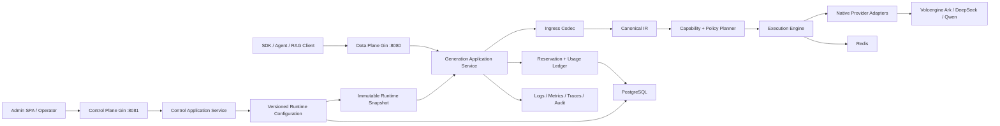
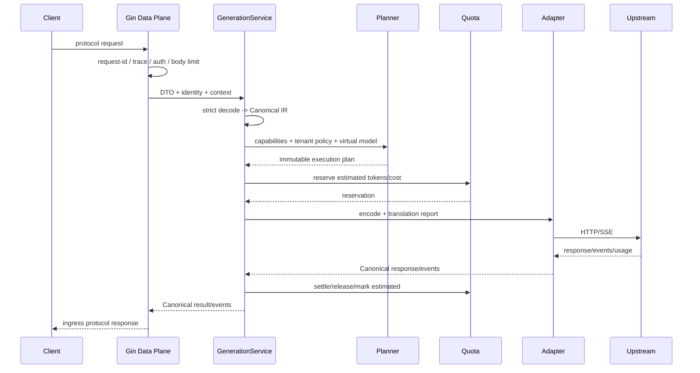

# AI Gateway v3 企业级重构设计文档

> 状态：Current Baseline（厂商范围已确认，按 M0～M6 实施）
>
> 日期：2026-08-06
>
> 适用代码基线：`master@c751bab`
>
> 目标：把当前功能密集的个人项目升级为可验证、可演进、可部署的企业级 LLM Gateway，同时形成一条面试时能够独立解释的 Go 工程主线。

## 0. 核心结论

本轮不再以“零框架”和“兼容 OpenAI 格式的 Base URL 转发”作为项目卖点，改为以下架构决策：

1. **HTTP 入口统一采用 Gin，核心业务不依赖 Gin。** 数据面与控制面均使用独立 `gin.Engine`，通过两个监听端口隔离；流式数据面仍直接使用底层 `http.ResponseWriter`、`http.Flusher` 和 `context.Context` 控制连接生命周期。
2. **多厂商能力以协议转换为核心，而不是 URL 切换。** 引入 Ingress Codec、Canonical IR、Capability Planner、Native Adapter、统一流事件和 Translation Report。
3. **先支持有真实 Credential 可验收的国内厂商，再扩展数量。** 客户端保留 OpenAI Chat Completions/Responses 兼容入口；首批上游只做火山引擎方舟、DeepSeek 和阿里云百炼 Qwen，三家分别实现 Native Dialect Adapter，不再声称兼容“所有 OpenAI 兼容端点”。
4. **企业能力围绕不变量设计。** 鉴权、租户、路由、额度、账本、审计和配置发布均有明确事务、失败语义与可观测证据。
5. **“企业级”是验收结果，不是形容词。** 在多实例、故障注入、并发额度、协议合约、持续运行和真实调用方未通过前，README 与简历不得提前使用“生产级/企业级”。

## 1. 当前系统审计与根因

### 1.1 现象

当前项目已经包含缓存、限流、重试、熔断、路由、鉴权、配额、审计和管理后台，但代码和 README 所呈现的能力密度高于可验证的协议与运行保证：

- 对外只有 `/v1/chat/completions`，内部 `provider.ChatRequest` 只能表达文本、温度、最大 Token 和 Stream。
- OpenAI Provider 实际承担“OpenAI-compatible HTTP 转发”；Claude 仅转换纯文本，且明确不支持 Streaming。
- Tool Calling、Structured Output、Reasoning、Multimodal、Citation、Prompt Cache 和厂商状态对象无法完整表达。
- `Server` 同时负责 HTTP、过滤、缓存、路由、Singleflight、Fallback、Retry、Breaker、Provider 调用、用量和审计。
- 路由只理解模型名、权重和延迟，不理解请求所需能力。
- 配额采用“请求前查询、请求后累加”，并在存储错误时 Fail Open。
- 配置热重载只替换部分字段，缓存、限流器、Transport、Store 和中间件未纳入统一运行时快照。
- 前端构建产物存在两份受 Git 跟踪的副本，构建源和嵌入源不唯一。

### 1.2 根因

| 根因 | 当前证据 | 结果 |
| --- | --- | --- |
| 领域模型由 OpenAI Chat 子集定义 | `provider.ChatRequest`、`Message.Content string` | 厂商能力只能丢弃、拼字符串或无法接入 |
| Provider 抽象混合职责 | 同一类型负责编码、鉴权、HTTP、SSE、解码、错误 | 新厂商复制代码，公共策略无法统一验证 |
| Handler 是流程中心 | `internal/server/server.go` 串联全部横切逻辑 | 难以做单元测试、运行时快照和协议演进 |
| 路由不做能力协商 | `Target` 只有 Provider/Model/Weight | Fallback 可能得到语义不等价结果 |
| 安全和额度没有事务不变量 | 明文 Token 缓存、非原子 Check/Record | 禁用延迟、并发穿透、账务不可对账 |
| 框架选择被当作能力证明 | README 以“零框架”为卖点 | 无法体现 Gin、DTO 校验、路由分组和成熟控制面实践 |

### 1.3 影响范围

- **协议正确性：** Tools、Reasoning、Structured Output、Multimodal 和流式 Tool 参数可能丢失。
- **可靠性：** 重试、Fallback、断流与 Breaker 对不同失败阶段缺少统一状态机。
- **安全与成本：** 配额存储失败仍调用上游；缓存和审计缺少完整租户边界。
- **可维护性：** 每增加一家厂商，都需要修改旧请求模型和 Server 主流程。
- **求职可信度：** 功能关键词很多，但面试官很容易从 Claude Streaming、配额并发或热重载追问出契约缺口。

## 2. 目标与非目标

### 2.1 目标

- 对客户端提供稳定的 OpenAI Chat Completions 与 Responses 入口。
- 原生适配火山引擎方舟、DeepSeek 和阿里云百炼 Qwen；协议相似也必须使用独立 dialect 与能力证据。
- 在路由前完成请求能力推导、模型能力校验和转换损失检查。
- 正确处理非流式、SSE、Tool Call、Reasoning、Structured Output、Multimodal 和 Usage。
- 支持组织、项目、API Key、Provider Credential、Virtual Model、Policy、Budget 和不可变 Usage Ledger。
- 支持单机开发和 PostgreSQL/Redis 多实例部署。
- 提供可复现构建、迁移、CI、协议回放、故障注入、Race 和负载测试。

### 2.2 非目标

- 不训练模型，不实现推理引擎或 GPU 调度器。
- 不在第一阶段支持所有厂商和所有 Beta API。
- 不把 Agent 编排、RAG、工作流执行塞进网关；网关只提供模型接入与治理。
- 不为了技术栈关键词引入 ORM、消息队列、Service Mesh 或 Kubernetes Operator。
- 不对不兼容能力做静默降级，不把厂商私有字段直接堆进公共 IR。

### 2.3 成熟度定义

| 等级 | 定义 | 对外表述 |
| --- | --- | --- |
| L0 Demo | 主路径可运行 | 个人项目/原型 |
| L1 Engineered | 分层、测试、错误语义、可复现构建 | 工程化 LLM Gateway |
| L2 Production-ready | 多实例、迁移、故障注入、负载与安全门禁通过 | 面向生产的 LLM Gateway |
| L3 Enterprise-validated | 真实调用方持续接入、容量与故障数据可复现 | 企业级 LLM Gateway |

本项目的代码目标是达到 L2；只有真实应用持续接入并形成运行证据后，才能声称达到 L3。

## 3. 总体架构



### 3.1 进程与监听边界

第一阶段保留一个二进制，但启动两个独立 `http.Server`：

- `:8080` 数据面：`/v1/chat/completions`、`/v1/responses`、`/v1/models`。
- `:8081` 控制面：`/admin/api/v1/**`、`/health/live`、`/health/ready`、`/metrics` 和管理 SPA。

这样既能共享进程生命周期，又能在网络策略、反向代理、超时和鉴权层面隔离管理接口。后续如需独立扩缩容，应用服务与领域层不变，只拆分启动入口。

### 3.2 分层规则

```text
edge (Gin / HTTP DTO)
  -> application (用例编排、事务边界)
    -> domain (Canonical IR、能力、策略、账务状态机)
      -> ports (Repository、Transport、Credential、Clock)
        -> infrastructure (PostgreSQL、Redis、厂商 HTTP、OTel)
```

- `gin.Context` 只存在于 edge 层，不传入 application/domain。
- application 接收标准 `context.Context` 和显式 DTO。
- Provider SDK/DTO 不得进入 Canonical IR、Router 或 Ledger。
- HTTP Handler 不直接访问数据库、Redis 或具体 Provider。

## 4. Gin 与标准库的取舍

### 4.1 决策

统一使用 `gin.New()` 创建数据面和控制面 Router，使用显式注册的 Middleware，不使用带隐式 Logger/Recovery 的 `gin.Default()`。

Gin 负责：

- 路由分组和版本化；
- 控制面 JSON Binding 与 DTO Validation；
- Authentication、RBAC、Request ID、Trace、Recovery 等入口中间件；
- 统一错误响应和 OpenAPI 接口适配；
- 测试时的 Handler 装配。

标准库负责：

- `http.Server` 生命周期、超时、连接与优雅关闭；
- SSE 写入、Flush、客户端取消和首字节提交判断；
- 上游 `http.Transport` 连接池、代理、TLS 和超时；
- 核心 `context.Context` 传播。

### 4.2 为什么不是“全部交给 Gin”

- Gin 本身建立在 `net/http` 上；长连接正确性仍取决于 `ResponseWriter`、Flusher 和 Context。
- 数据面不得使用自动响应压缩、响应体日志或会缓冲 SSE 的中间件。
- `gin.Context` 来自对象池，不能跨请求保存，也不能直接传给后台 Goroutine。
- 框架是 HTTP Adapter，不是业务架构。核心服务保持框架无关，才能做协议合约与并发测试。

### 4.3 成熟组件选择

| 场景 | 选择 | 原因 |
| --- | --- | --- |
| HTTP Router | Gin | 展示主流 Go Web 工程实践，适合路由分组和控制面 |
| 控制面契约 | OpenAPI 3.1 + `oapi-codegen` | Spec-first，避免 Handler DTO 漂移 |
| PostgreSQL | `pgx/v5` + `pgxpool` | 明确事务和连接池控制 |
| SQL | `sqlc` | 保留 SQL 可见性，同时生成类型安全访问代码 |
| Migration | `goose` | 版本化、可审计、可在 CI 验证 |
| Redis | `go-redis/v9` | 现有依赖可保留 |
| 日志与 Trace | `slog` + OpenTelemetry | 现有资产可演进，不重复引入日志框架 |
| 配置解析 | `yaml.v3` KnownFields + 显式校验 | 严格契约优先，不为关键词引入隐藏默认值 |
| DI | 手工 Composition Root | 依赖关系可见，当前规模不需要 DI 框架 |

## 5. 建议目录结构

```text
cmd/gateway/                    # 进程入口与生命周期
internal/bootstrap/             # Composition Root、配置装配
internal/edge/dataplane/        # Gin 数据面、外部错误映射
internal/edge/controlplane/     # Gin 控制面、OpenAPI generated interface
internal/app/generation/        # Generate/Stream 用例
internal/app/admin/             # Key、Provider、Route、Budget 管理用例
internal/protocol/canonical/    # Canonical Request/Response/Event
internal/protocol/ingress/
  openaichat/                   # /v1/chat/completions Codec
  openairesponses/              # /v1/responses Codec
internal/provider/
  ark/                          # 方舟 Responses/Chat Codec
  deepseek/                     # DeepSeek Chat/Reasoning Codec
  qwen/                         # 百炼 Chat/Responses Codec
  transport/                    # HTTP Client、连接池、超时、TLS
  conformance/                  # 共享 Adapter 合约测试
internal/routing/               # Capability Gate、Policy、Planner
internal/resilience/            # Retry、Breaker、Fallback 状态机
internal/quota/                 # Reservation、Settlement、Ledger
internal/identity/              # Tenant、Project、API Key、RBAC
internal/runtime/               # 不可变 Snapshot 与版本切换
internal/store/postgres/        # pgx/sqlc Repository
internal/store/sqlite/          # 仅 standalone 的实现
internal/observability/         # logs/metrics/traces/audit
api/openapi/control-v1.yaml     # 控制面契约
testdata/providers/             # 脱敏请求、响应、SSE Golden Fixture
```

## 6. 协议与多厂商 Adapter

### 6.1 支持范围

| 协议/厂商 | 第一阶段支持 | 必须覆盖 |
| --- | --- | --- |
| OpenAI Chat Completions Ingress | 是 | Text、Tools、JSON/Schema 请求意图、Reasoning 扩展、Multimodal、SSE、Usage |
| OpenAI Responses Ingress | 是 | Typed Items、Tools、Reasoning、Structured Output、State、Typed SSE |
| 火山引擎方舟 Egress | 是 | Responses 优先；typed Items、`call_id`、`previous_response_id`、Thinking、Tools、Streaming、Usage |
| DeepSeek Egress | 是 | Chat、`reasoning_content`、Thinking + Tool 回传、JSON Object、SSE、Usage |
| Qwen（阿里云百炼）Egress | 是 | Chat/Responses、Thinking、Tools、模型相关 Multimodal/JSON、Typed SSE、Usage |
| 通用 OpenAI-compatible Egress | 后续 | 只有建立独立 dialect、Fixture 与实测证据后才接入 |
| OpenAI/Anthropic/Gemini Egress | 后续 | 当前无 API Credential，不进入首批能力声明和 Exit Gate |
| Realtime/WebSocket/Batch | 后续 | 先预留事件模型，不在首期实现 |

三家都存在“看起来兼容 OpenAI、实际语义并不相同”的部分：方舟 Responses 使用 response item、`call_id` 和 `previous_response_id`；DeepSeek 在 Thinking + Tool 场景要求后续请求完整回传 `reasoning_content`，缺失会返回 400；Qwen 同时提供 Chat 与 Responses，但只处理文档明确列出的兼容参数，地域 Endpoint、Thinking 参数和模型能力也不同。因此内部模型必须基于 typed Item/Block/Event 和显式 Provider State，不能继续使用单一字符串消息或通用 Base URL 转发。

### 6.1.1 三家能力验证策略

- **方舟：** 以 Responses 为主线证明 typed item、built-in tool、thinking 和 vendor-managed conversation；Chat 作为独立 dialect，不共享未验证字段集合。
- **DeepSeek：** 优先证明 `reasoning_content`、thinking + tool call 多轮回传、SSE 和 JSON Object。Beta strict tool endpoint 作为实验能力，不默认进入稳定路由。
- **Qwen：** 分开验证 Chat 与 Responses；模型、地域、Workspace Endpoint、`enable_thinking`/`reasoning.effort`、仅流式限制和多模态能力全部进入 Capability Evidence。
- **离线与在线分层：** CI 使用脱敏 Golden、SSE Replay 和 Conformance；真实 Smoke Test 通过 `ARK_API_KEY`、`DEEPSEEK_API_KEY`、`DASHSCOPE_API_KEY` opt-in 执行。没有 Key 时标记 `unverified`，不能用 Mock 伪造 verified。

### 6.2 Canonical IR

Canonical IR 表达公共语义，不追求所有厂商字段完全一致，也不退化成最低公共子集。

```go
type Request struct {
    ID              string
    VirtualModel    string
    Instructions    []ContentBlock
    Items           []Item
    Tools           []ToolDefinition
    ToolChoice      ToolChoice
    OutputFormat    OutputFormat
    Reasoning       ReasoningConfig
    Sampling        SamplingConfig
    Stream          bool
    State           ConversationState
    Required        CapabilitySet
    Extensions      ExtensionSet
}

type Item struct {
    Type       ItemType
    Message    *MessageItem
    ToolCall   *ToolCallItem
    ToolResult *ToolResultItem
    Reasoning  *ReasoningItem
}

type ContentBlock struct {
    Type     ContentType // text, image, audio, file, refusal, citation
    Text     string
    Media    *MediaRef
    Metadata map[string]string
}
```

关键约束：

- `ToolCall.ID` 与 `ToolResult.CallID` 必须完整保留。
- Tool Arguments 在流式阶段按字符串 Delta 传递，只在 Block 完成后校验 JSON。
- Reasoning 可包含摘要、签名或厂商返回的 opaque/encrypted state；不能伪造成普通文本。
- Structured Output 保存原始 JSON Schema 与 strict 语义，不允许转换为“请输出 JSON”的 Prompt。
- Multimodal 保留 Block 顺序、MIME、URL/Base64/File ID 和大小限制。
- Vendor Extension 只能由同厂商 Adapter 消费；切换厂商前必须明确拒绝或报告不可迁移。

### 6.3 能力模型

能力不是简单布尔值，而是“支持级别 + 约束”：

```text
Capability
  - text
  - vision / audio / document
  - function_tools / parallel_tools / strict_tools
  - json_mode / json_schema
  - reasoning_summary / reasoning_state_replay
  - citations
  - prompt_cache
  - stateful_conversation
  - stream_text / stream_tool_args / stream_usage / stream_error
```

每项能力使用以下状态：

- `native`：厂商协议直接支持且有 Conformance Test。
- `equivalent`：通过无损转换实现，有证明语义等价的测试。
- `conditional`：只对特定模型、区域、版本或参数组合成立。
- `unsupported`：路由前拒绝。

请求所需能力由 Ingress Codec 根据实际字段自动推导。客户端不能通过伪造 `required_capabilities` 绕过校验。

### 6.4 Translation Report

每次协议转换返回结构化报告：

```go
type TranslationReport struct {
    Preserved   []FieldPath
    Transformed []Transformation
    Rejected    []UnsupportedField
    Warnings    []CompatibilityWarning
}
```

- `Rejected` 非空时不得调用上游。
- `Warnings` 只允许不会改变请求语义的差异，例如字段默认值由目标协议显式补全。
- 调试日志记录字段路径和原因，不记录字段原始内容。
- 管理端提供 Dry Run 接口，解释某请求为什么能或不能路由到目标模型。

### 6.5 Adapter 边界

```go
type Codec interface {
    Encode(context.Context, canonical.Request, Target) (wire.Request, TranslationReport, error)
    Decode(context.Context, wire.Response) (canonical.Response, TranslationReport, error)
    NewStreamDecoder(io.ReadCloser) (StreamDecoder, error)
}

type StreamDecoder interface {
    Next(context.Context) (canonical.Event, error)
    Close() error
}

type ErrorDecoder interface {
    Decode(status int, header http.Header, body []byte) *GatewayError
}
```

厂商包由以下组件组成：

- Codec：Canonical 与厂商 DTO 双向转换。
- StreamDecoder：SSE 分帧、事件解析、序号和结束状态。
- ErrorDecoder：状态码、厂商错误码、Retry-After、受限错误摘要。
- AuthSigner：Bearer、`x-api-key`、`x-goog-api-key` 等鉴权差异。
- CapabilityProvider：按模型、协议版本和区域提供能力。
- Fixture/Conformance：证明所有已声明能力。

Transport 不放在 Adapter 中。它由统一工厂按 Provider Endpoint 构造不可变 `http.Client`，隔离连接池、代理、TLS、超时与最大连接数。Client 构造完成后不再通过 `SetTransport` 修改。

### 6.6 统一流事件

```text
response.started
output_item.started
content_block.started
text.delta
reasoning.delta
tool_call.started
tool_call.arguments.delta
content_block.completed
usage.delta
output_item.completed
response.completed
response.failed
```

事件包含 `sequence`、`output_index`、`content_index`、`item_id`、`call_id` 和可选 Vendor Metadata。Ingress Encoder 再把统一事件转换为 OpenAI Chat Chunk 或 Responses typed event。

流状态机：

```text
Accepted -> Planned -> Connecting -> Committed -> Streaming -> Completed
                                      |              |-> ClientAborted
                                      |              |-> UpstreamFailed
                                      |-> FailedBeforeCommit
```

- 只有 `Committed` 前允许 Retry/Fallback。
- 上游建立连接不等于已经 Commit；首个合法事件准备写给客户端才 Commit。
- 只有正常 `Completed` 才发送协议结束事件；客户端写失败后不得继续发送 `[DONE]`。
- 客户端取消必须传播到上游、事件解析、缓存收集和用量结算。
- 未知厂商事件类型按版本策略处理：可安全忽略的扩展记录 Debug；影响完成语义的事件返回 Protocol Error。

## 7. 请求执行链路



### 7.1 中间件顺序

数据面：

```text
RequestID -> Trace -> Recovery -> SecurityHeaders -> Auth
-> Tenant/Project -> Admission -> Key RateLimit -> Handler
```

需要解析请求内容的策略不放进 Gin Middleware，进入 `GenerationService` 后按以下顺序执行：

```text
Strict Decode -> Request Validation -> Capability Derivation
-> Tenant/Model Policy -> Candidate Planning -> Cache Eligibility
-> Quota Reservation -> Execute -> Settle -> Audit
```

控制面：

```text
RequestID -> Trace -> Recovery -> OIDC/Session -> CSRF
-> RBAC -> DTO Validation -> Handler -> Audit
```

### 7.2 缓存与 Singleflight

- 企业模式默认关闭语义缓存；它改变结果语义，必须由项目级显式策略开启并独立评测。
- 精确缓存只允许无 Tool、无外部状态、无 Vendor-managed Conversation、无敏感数据且满足可缓存策略的请求。
- Cache Key 包含 tenant、project、virtual model、policy revision、Canonical Request Hash 和协议语义版本。
- 缓存数据按租户隔离，可配置加密与 TTL；管理 API 不返回 Prompt/Response 原文。
- Singleflight 只合并同租户、同策略且明确可合并的请求；所有订阅者取消后才取消共享上游调用。
- Cache Hit 也写 Usage Event，但 upstream token/cost 为 0，并明确标记 `source=cache`。

## 8. 路由、Retry、Breaker 与 Fallback

### 8.1 决策顺序

```text
协议能力满足
-> 租户/项目/Key 权限
-> 数据驻留与合规
-> 预算与最大成本
-> Endpoint/Model 健康
-> 成本、延迟、质量、权重调度
```

Planner 输出不可变 `ExecutionPlan`，包含首选目标、允许的 Fallback、每个目标的能力证明、成本上界和拒绝原因。

### 8.2 错误分类

统一错误类型至少包含：

- `invalid_request`
- `authentication` / `permission`
- `capability_mismatch`
- `budget_exceeded`
- `rate_limited`
- `upstream_overloaded`
- `upstream_timeout`
- `transport`
- `protocol`
- `client_cancelled`
- `internal_dependency`

错误保留 `provider_code`、HTTP status、Retry-After、阶段和是否已 Commit，但返回客户端前必须脱敏。

### 8.3 Retry 与 Fallback

- 只重试明确可重试且没有客户端取消的错误。
- 遵守 Retry-After、总 Deadline、尝试次数和总等待预算。
- 对可能已被上游接收的 POST，只有厂商支持 Idempotency Key 或能证明请求尚未写出时才自动重试。
- Fallback 必须重新做 Capability、Policy 和 Budget 检查；更贵目标需要先原子调整 Reservation。
- 流式 Commit 后不切换厂商；错误通过当前 Ingress 协议显式终止。
- Hedging 默认关闭，因为它可能产生双倍 Token 成本；只有显式预算和取消证明后才能开启。

### 8.4 Circuit Breaker

- 隔离键使用 `endpoint_id + model + region`，而不是只按 provider 名称。
- 客户端 4xx、能力错误和取消不计入上游失败。
- Half-open 探测有并发上限，状态变化产生日志、指标和管理事件。
- Breaker 本地状态优先，避免 Redis 故障让全部实例同时失去保护；集群健康视图用于路由参考，不替代本地保护。

## 9. 身份、安全与租户

### 9.1 身份模型

```text
Organization
  -> Project
    -> Gateway API Key
    -> Virtual Model / Route Policy / Budget
  -> Member / Role
  -> Provider Account
    -> Encrypted Credential
    -> Endpoint / Model
```

- 数据面使用 Gateway API Key；控制面的人类用户使用 OIDC/Session，开发模式才允许本地 bootstrap admin。
- API Key 建议格式为 `agw_<env>_<key_id>_<random_secret>`，通过 `key_id` 定位记录，对高熵 secret 使用 HMAC-SHA256 摘要并常数时间比较；数据库只保存前缀和摘要。
- Provider Credential 使用 envelope encryption。开发模式可使用环境变量主密钥，生产模式对接 KMS；密钥版本与轮换状态入库。
- Provider Base URL 只能来自受控 Endpoint，禁止任意用户输入 URL，防止 SSRF、内网探测和凭据泄漏到恶意主机。
- Redirect 默认关闭；TLS 最低版本、代理和自定义 CA 通过受控配置管理。

### 9.2 数据保护

- 不记录 Authorization、API Key、Credential、完整 Prompt/Response、Tool 参数原文和未脱敏 PII。
- 普通审计只记录元数据、哈希、Token、费用、状态和延迟。
- Prompt/Response 留存为单独的项目策略，默认关闭，并明确加密、TTL、访问审计和删除流程。
- PII Filter 定位为可配置的基础规则，不声称替代专业 DLP；误报、漏报和旁路条件必须文档化。

## 10. 配额、预算与 Usage Ledger

### 10.1 状态机

```text
Requested -> Reserved -> InFlight -> Settled
                 |           |-> PartiallySettled
                 |           |-> Released
                 |           |-> NeedsReconcile
                 |-> Rejected
```

### 10.2 不变量

- Reservation、Usage Event 和 Ledger Entry 使用 `request_id/event_id` 保证幂等。
- Token 与金额使用整数；金额以最小货币单位或固定精度 Decimal 表示，不使用 float。
- 价格在请求时生成 Price Snapshot，历史账单不受后续价格修改影响。
- 请求前原子预占估算 Token/金额；完成后按厂商 Usage 结算并释放差额。
- 流式取消、断流、缺失 Usage 和 Provider 超时都有确定状态；缺失 Usage 使用可解释估算并标记 `estimated=true`。
- Ledger 只追加不更新；修正通过 reversal/adjustment 事件。
- 配额依赖故障默认 Fail Closed。若未来允许有限 Fail Open，必须配置风险上限、审计、告警和补偿流程。

## 11. 配置与运行时快照

### 11.1 配置来源

- Bootstrap YAML：监听端口、数据库、Redis、KMS、日志、运行模式等启动必需项。
- Control Plane DB：Provider、Model、Virtual Model、Route、Policy、Budget 和 Feature Flag。
- Secret Source：环境变量、Secret Manager 或 KMS，不进入普通配置导出。

### 11.2 发布模型

1. 控制面在事务中写入配置草稿。
2. Validator 构造完整 Snapshot，检查交叉引用、能力、密钥与策略。
3. 发布生成单调递增 `revision` 与 Outbox Event。
4. 数据面收到通知或轮询到新 revision，完整构建依赖。
5. 所有组件成功后通过 `atomic.Pointer[RuntimeSnapshot]` 一次交换。
6. 每个请求开始时捕获一个 Snapshot，整个生命周期只使用该版本。
7. 旧 Transport/Store 等资源引用归零后再关闭。

构建失败保持旧 Snapshot，不允许 Router 已更新而 Cache/Policy 仍是旧版本。日志记录 revision、changed sections、结果和拒绝原因，不记录秘密。

## 12. 数据与基础设施

### 12.1 持久化边界

PostgreSQL 为生产模式事实源；SQLite 仅用于 standalone 开发和演示，并通过 Repository Conformance Test 保持关键语义一致。

核心实体：

- organizations / projects / members
- gateway_keys / provider_accounts / provider_credentials
- model_endpoints / virtual_models / route_policies / policy_revisions
- budgets / reservations / usage_events / ledger_entries / price_snapshots
- audit_events / config_revisions / outbox_events

### 12.2 Redis 边界

Redis 只承载可重建或需要跨实例协调的临时状态：

- 分布式 Rate Limit；
- 精确响应缓存；
- 配置 revision 通知；
- 可选 Endpoint 健康摘要。

Key、预算、账本和审计事实不能只存在 Redis。Redis 故障时各能力的 Fail Open/Closed 必须分别定义，并反映到 readiness。

## 13. 可观测性

### 13.1 日志

稳定字段：

```text
request_id trace_id tenant_id project_id key_id
protocol virtual_model target_id provider model adapter_revision
required_capabilities decision_reason config_revision
attempt error_kind committed duration_ms queue_ms upstream_ms first_token_ms
reservation_id settlement_result usage_estimated
```

### 13.2 指标

- 请求量、错误率、排队、首 Token、总延迟；
- Provider/Model 成功率、429、5xx、协议错误；
- Retry、Fallback、Breaker 状态变化；
- Capability Rejection 与 Translation Warning；
- Reservation、Settlement、Release、Reconcile；
- Stream 客户端取消、上游断流和未正常完成；
- Cache Hit 按 source/policy 分类。

Prometheus Label 不使用 request_id、tenant_id、key_id 等高基数字段；租户级明细从 Ledger/Audit 查询。

### 13.3 Trace 与解释能力

主要 Span：`ingress.decode`、`policy.plan`、`quota.reserve`、`provider.encode`、`provider.connect`、`stream.first_event`、`quota.settle`。管理端提供 Route Dry Run 和 Request Timeline，使“为什么选择/拒绝某目标”可追踪。

## 14. 测试与质量门禁

| 层级 | 必须测试 |
| --- | --- |
| Canonical | 构造器、不变量、JSON Schema、Tool ID、Reasoning State |
| Ingress Codec | Chat/Responses 请求响应 Golden、未知字段和错误映射 |
| Adapter | 每厂商双向 Golden、Capability Conformance、Header/URL/Auth |
| Streaming | 跨 Buffer、CRLF、多 data 行、Unicode、Tool JSON Delta、未知事件、流内 Error、异常 EOF |
| Planner | 能力、权限、合规、预算、健康、成本顺序和拒绝原因 |
| Resilience | 429/Retry-After、5xx、超时、取消、Commit 前后、Fallback 等价性 |
| Quota | 并发预占、重复事件、释放、冲正、缺 Usage、数据库故障 |
| Security | 越权、禁用/轮换 Key、SSRF、日志 Secret Scan、跨租户反向测试 |
| Runtime | Snapshot 构建失败、原子切换、并发请求、旧资源释放、Race |
| Deployment | Migration、两实例、Redis/DB 故障、Readiness、Graceful Shutdown |

CI 门禁：

```text
gofmt / go test ./... / go test -race ./... / go vet ./...
staticcheck / golangci-lint / govulncheck
Adapter conformance / fuzz smoke / migration integration
frontend lint + test + build
Docker image build + health/readiness smoke
secret scan + dependency review
```

目标不是只提高总覆盖率，而是关键不变量全部有失败测试。协议解析器增加 Go Fuzz Test；流和并发增加 goroutine leak/soak test。

### 14.1 可复现性能目标

以下是验收目标，不是当前项目数据：

- 固定硬件与脚本下，网关自身 Unary P95 开销不高于 5 ms。
- 500 个并发 SSE 连接下，首事件转发附加 P95 不高于 10 ms。
- 30 分钟 Soak Test 无持续 Goroutine、连接或内存增长。
- 并发额度测试无预算穿透、无重复结算。
- Provider 故障注入下，无请求在 Commit 后静默切换厂商。

所有性能数字必须在 `benchmarks/` 保存环境、命令、请求模型和原始结果。

## 15. 部署与运行

- 多阶段 Docker 构建，前端产物只有一个生成源，构建后工作树保持干净。
- 生产使用 PostgreSQL + Redis；本地可使用 SQLite 且显式标记 standalone。
- Liveness 只判断进程；Readiness 反映数据库、配置 Snapshot、必要 Credential 与迁移状态。
- 数据面长流不设置固定 `WriteTimeout` 截断响应，而使用 Header Timeout、Idle/Request Policy 和 Context Deadline。
- Shutdown 顺序：停止接收 -> 等待 Unary -> 通知/取消 Stream -> 结算未完成 Reservation -> Flush Audit/Trace -> 关闭依赖。
- 第一阶段 Docker Compose 两实例验证；Kubernetes Manifest 只在行为验证完成后增加。

## 16. 实施里程碑

`M` 是 Milestone（里程碑），不是模型版本。`M0` 表示第 0 个里程碑：先建立可信基线，使后续每次失败都能区分旧问题与新回归；它不是“先交付一个功能缩水版”。

M0～M6 已进一步拆为 Task 1～Task 62，任务依赖、交付物、验证和禁止项以 `docs/AI_Gateway_v3_项目实施任务书.md` 为执行基线。同一时间只实施一个 Task；前一 Task 未完成时，不开始后一 Task。

### M0：可信基线（3～5天）

交付：

- 修复双份前端产物和跨平台构建；
- 严格配置解析、默认值、校验与弱示例 Key；
- CI、lint、race、build、secret scan；
- 为 Config、Store、Provider、Reload 补保护测试；
- README 将未经验证的“企业级/所有厂商兼容”降为真实表述。

Exit Gate：新环境可按文档启动；质量门禁全绿；构建不污染工作树；关键包不再零覆盖。

### M1：Gin 入口与应用边界（4～6天）

交付：

- 数据面/控制面双 Gin Engine 与双监听；
- 从 `Server` 提取 `GenerationService`；
- 标准错误 Envelope、Request Context、生命周期与 Snapshot v1；
- 保持现有 Chat 文本行为兼容。

Exit Gate：Handler 不直接访问具体 Provider/Store；流取消和优雅关闭有测试；核心包不依赖 Gin。

### M2：Canonical IR 与双 Ingress（6～8天）

交付：

- Canonical Item/Block/Event、Capability、Translation Report；
- Chat Completions 与 Responses Ingress；
- Provider-independent GenerationService 与可注入测试 Transport；
- Text、Tools、Structured Output、Reasoning、Multimodal、Streaming Golden。

Exit Gate：双入口经过同一 GenerationService；typed event 不降格为字符串；不支持能力在上游前拒绝。

### M3：国内三厂商 Native Dialect Adapter（8～12天）

交付：

- 火山引擎方舟 Responses/Chat Adapter；
- DeepSeek Chat/Reasoning Adapter；
- Qwen Chat/Responses Adapter；
- Adapter Conformance Suite、脱敏 SSE Fixture 与 opt-in 真实 API Smoke Matrix。

Exit Gate：三家各自的 Codec 与 Capability Evidence 独立；每个声明能力均有合约测试，持有 Key 的目标完成真实 Smoke；Tool/Reasoning/Usage/Provider State/Stream Error 不丢失；未实测组合明确为 unverified。

### M4：能力路由与韧性状态机（6～8天）

交付：

- Virtual Model、Capability Planner、Execution Plan；
- 分阶段 Retry/Fallback、target 级 Breaker；
- Route Dry Run 与可解释日志；
- 正确的流式 Commit Barrier。

Exit Gate：不兼容目标永不进入执行链；Commit 后不切换；取消不重试；故障注入通过。

### M5：企业控制面与账本（8～12天）

交付：

- OpenAPI-first Gin 控制面；
- Organization、Project、OIDC/RBAC、Key、Credential；
- PostgreSQL/sqlc/goose；
- Budget Reservation、Settlement、Usage Ledger、Audit。

Exit Gate：跨租户测试全拒绝；Key/Credential 不明文落库；并发配额不穿透；重复事件不重复扣费。

### M6：多实例与真实验证（5～7天）

交付：

- Redis 分布式限流与配置通知；
- 两实例 Compose；
- MovieInsight 与 Deep Research 两个真实调用方；
- Load/Soak/Fault Report、迁移指南和 Release。

Exit Gate：两实例配置一致；依赖故障符合设计；性能结果可复现；至少两个真实调用方持续接入。

### 16.1 秋招优先级

求职不等待 M6。优先在 3～4 周内完成 M0～M3，形成以下可演示闭环：

```text
OpenAI Chat/Responses Client
-> Gin Data Plane
-> Canonical IR + Capability Check
-> Ark / DeepSeek / Qwen Native Dialect Adapter
-> Typed SSE / Tool Call / Usage
-> Offline Conformance + Real API Smoke + Trace
```

M4～M6 用于把项目从“协议工程亮点”提升为“企业平台与一致性亮点”。

## 17. 面试叙事

完成对应里程碑后，可围绕三个问题讲述：

1. **为什么使用 Gin 但不让核心依赖 Gin？** 说明框架用于入口生产力和控制面契约，标准库用于流生命周期，业务以 `context.Context` 和 Ports 解耦。
2. **为什么不能只做 OpenAI-compatible 转发？** 用方舟的 response item/state、DeepSeek 的 reasoning 回传约束、Qwen 的 Chat/Responses 与地域/模型差异解释 Canonical IR、Capability Evidence 和 Translation Report。
3. **企业网关如何保证钱和语义都不丢？** 用 Commit Barrier、能力等价 Fallback、Reservation/Settlement/Ledger 和故障注入说明正确性。

简历只有在完成 M0～M3 后才可以写：

> 基于 Gin 构建双平面 LLM Gateway，以 Canonical IR 原生适配火山方舟、DeepSeek 与 Qwen 的 Chat/Responses dialect；通过模型级 Capability Evidence、Adapter Conformance 与真实 API Smoke Test，保证 Tool Calling、Reasoning、Structured Output、Usage 和 SSE 状态在跨厂商路由中不被静默丢失。

完成 M4～M6 且有真实数据后再增加多租户、账本、多实例和性能数字。

## 18. 设计验收清单

- [x] Gin 双平面与核心框架无关的边界已纳入当前基线。
- [x] 首批上游固定为火山方舟、DeepSeek、Qwen；国外厂商不进入首批验收。
- [x] M0～M6 已拆为 Task 1～Task 62；每个 Task 默认对应一个原子提交。
- [ ] 公共 API、Canonical IR、账本和配置 Snapshot 分别形成 ADR。
- [ ] 修改运行时代码前先建立当前行为回归测试。
- [ ] README 和简历表述始终落后于实际 Exit Gate，不提前宣传。

## 19. 官方协议依据

- [Gin Middleware 官方文档](https://gin-gonic.com/en/docs/middleware/using-middleware/)：Gin 支持全局、路由组和单路由中间件，适合划分数据面与控制面入口职责。
- [Gin Binding 与 Validation 官方文档](https://gin-gonic.com/en/docs/binding/binding-and-validation/)：控制面 DTO 使用显式 Binding/Validation，并避免 MustBind 提前写响应造成错误映射失控。
- [火山方舟 Responses 工具调用官方文档](https://www.volcengine.com/docs/82379/1958524?lang=zh)：Responses 使用 function call item、`call_id`、`previous_response_id`，并提供内置工具与 typed output。
- [火山方舟快速入门官方文档](https://www.volcengine.com/docs/82379/1795150)：给出 Ark `/api/v3` Endpoint、Responses 调用和 `thinking` 扩展。
- [DeepSeek Thinking Mode 官方文档](https://api-docs.deepseek.com/guides/thinking_mode)：Thinking + Tool 场景必须在后续请求完整回传 `reasoning_content`，否则返回 400。
- [DeepSeek Tool Calls 官方文档](https://api-docs.deepseek.com/guides/tool_calls)：区分普通、Thinking 和 Beta strict tool 模式。
- [DeepSeek JSON Output 官方文档](https://api-docs.deepseek.com/guides/json_mode/)：`json_object` 需要 Prompt 约束，并明确存在偶发空内容风险。
- [Qwen Responses 官方文档](https://help.aliyun.com/zh/model-studio/qwen-api-via-openai-responses)：Responses 只处理明确列出的兼容参数，支持 typed output、`previous_response_id`、地域专属 Endpoint 和内置工具。
- [Qwen 流式输出官方文档](https://help.aliyun.com/zh/model-studio/stream)：Chat 流式 Thinking 分离 `reasoning_content`/`content`，Usage 通过 `stream_options.include_usage` 获取。
- [Qwen 深度思考官方文档](https://help.aliyun.com/zh/model-studio/deep-thinking/)：模型对 `enable_thinking` 和思考模式的支持存在差异，必须按模型建能力矩阵。
